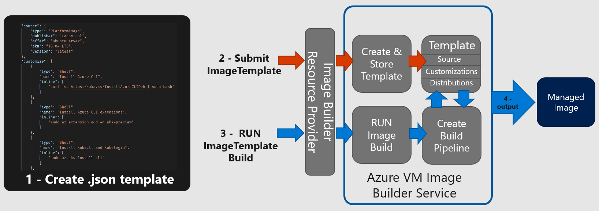

# Azure Kubernetes Service (AKS) Jump Box Builder

Nowadays it is paramount for many organizations to restrict network access to their AKS cluster's control plane (API Server) to reduce the surface of attack and at the same time being compliance with regulations in their respective industries. This is done via the AKS [authorized IP range](https://docs.microsoft.com/azure/aks/api-server-authorized-ip-ranges) feature or the [AKS private cluster](https://docs.microsoft.com/azure/aks/private-clusters) offering. This often means that a cluster operator can no longer perform administrative actions against the cluster directly from all networks but permitted addresses only. A common solution is to use designated virtual machines, residing on a subnet with a particular address range that has been granted sufficient network line of sight to the AKS API server and/or node pool nodes.

These virtual machines are access points, typically called jump boxes, which are meant to be used at various times in the lifecycle of a cluster; most notably in break-fix situations. When a high severity issue is happening, operators want immediate access to resolve the issue efficiently. This means that the jump box should include all of your expected triage & mitigation tooling and be highly available. However, because it has network line-of-sight to your cluster's control plane, it needs to be a governed/observable resource and is also considered a new attack vector for your cluster.

## Solution

[Azure Image Builder](https://docs.microsoft.com/azure/virtual-machines/image-builder-overview) (AIB) is a managed service that generates virtual machine (VM) images for you. It is built upon [HashiCorp Packer](https://www.packer.io). We'll use this service to build a general-purpose AKS jump box image that you could consider using as a starting point for your own jump box image. While this image could be built in other ways, Azure Image Builder helps customers think about their jump box image in a way that can be successfully managed via infrastructure-as-code and integrated into build pipelines.



> The image generated by this specific process has not undergone any specific hardening or integration with security agents (antivirus, FIM, etc). Before you take a dependency on this, or any jumpbox image, ensure it complies with your requirements.

While these instructions are targeting the building of a general-purpose AKS jump box VM image, these instructions could be referenced for other VM image purposes (such as build agents). These instructions do NOT address pushing images to a Azure Compute Gallery or any other features of the Azure Image Builder service. To see the full features of the service, [review the service's documentation](https://docs.microsoft.com/azure/virtual-machines/image-builder-overview).

## Installed software

* [Azure CLI](https://docs.microsoft.com/cli/azure/what-is-azure-cli)
* [kubectl](https://kubernetes.io/docs/reference/kubectl/overview/) and [kubelogin](https://github.com/Azure/kubelogin)
* [Helm CLI](https://helm.sh)
* [Flux v2 CLI](https://fluxcd.io)
* [Kubnernetes Azure AD Workload Identity CLI](https://azure.github.io/azure-workload-identity)
* [Open Service Mesh CLI](https://openservicemesh.io)
* HashiCorp [Terraform CLI](https://www.terraform.io)

## Isolated build network

The Azure Image Builder service supports hosting the image building process in a subnet that you bring. This feature allows you to generate the images within the security constraints of your own network; providing inbound & outbound network controls. It also allows you to access otherwise network-restricted resources you wish to include in your final image. This specific AKS jump box implementation is built around this bring-your-own-subnet model and provides no instructions for the public network model.

## Before we begin

1. **Identify/plan your subnet.** The subnet in which you will be building the image from within needs to meet the following requirements.
   1. The subnet must be no smaller than a `/28`, and must have **four IP addresses available**.

      <details>
      <summary>:mag: IP usage details</summary>

      * Azure Load Balancer (Internal/Standard)
      * NIC attached to the AIB Proxy VM (Orchestrates the building of the image.)
      * NIC for PrivateLink (Allows connectivity between the AIB Service and the AIB Proxy VM.)
      * NIC attached to the Packer VM (Used to build the final image.)
      </details>

   1. The subnet may have a Network Security Group (NSG) applied to it as long as it is at least as permissive as the following:

        **Inbound**

        | Source            | Source Port | Destination    | Destination Port | Protocol | Action | Reason                                                                     |
        |-------------------|-------------|----------------|------------------|----------|--------|----------------------------------------------------------------------------|
        | AzureLoadBalancer | *           | VirtualNetwork | `60001`          | TCP      | Allow  | LoadBalancer Health Probe to AIB Proxy VM (`60001` is SSH on the Proxy VM) |
        | VirtualNetwork    | *           | VirtualNetwork | `60001`          | TCP      | Allow  | From AIB PrivateLink IP to AIB Proxy VM                                    |
        | VirtualNetwork    | *           | VirtualNetwork | `22`             | TCP      | Allow  | For Packer VM to receive an SSH connection from the AIB Proxy VM           |
        | Any               | *           | Any            | *                | Any      | Deny   | Block all other inbound traffic                                            |

        **Outbound**

        | Source         | Source Port | Destination    | Destination Port | Protocol    | Action | Reason                           |
        |----------------|-------------|----------------|------------------|-------------|--------|----------------------------------|
        | VirtualNetwork | *           | Internet       | `443`            | TCP         | Allow  | For AIB Proxy VM to communicate to Azure Management APIs & Azure Storage (for logs and VHD image). And for Packer VM to install tooling. This traffic can be optionally restricted further in your egress firewall solution.  |
        | VirtualNetwork | *           | Internet       | `80`             | TCP         | Allow  | For Packer VM to handle apt-get update/upgrade/install requests. This traffic can be optionally restricted further in your egress firewall solution. |
        | VirtualNetwork | *           | VirtualNetwork | `22`             | TCP         | Allow  | For AIB Proxy VM to connect to Packer VM via SSH to initiate image build. |
        | VirtualNetwork | *           | _as needed_    | _as needed_      | _as needed_ | Allow  | For Packer VM to access any additional resources your Packer specification uses as part of the build process |
        | Any            | *           | Any            | *                | Any         | Deny   | Block all other outbound traffic |

        Ensure Azure Diagnostics and/or NSG Flow Logs are configured to help you troubleshoot any unexpected blocked traffic.

        Note, there is UDP traffic that will be _blocked_ with the above configuration. As the AIB Proxy VM and Packer VM is booting, they attempt to make NTP connections. Unless your situation requires otherwise, it's generally safe to block those here; the image build process will still function.

        For the image built by this repo's specification, your NSG does not need to allow any other _as needed_ outbound access.

   1. The subnet may have a **route table** applied to it that force tunnels "Next Hop" to your NVA (such as Azure Firewall in a hub network).
   1. The subnet must have `privateLinkServiceNetworkPolicies` set to `Disabled` as PrivateLink is how Azure Image Builder service and the transient AIB Proxy VM communicates.
   1. The subnet must be in the same _subscription_ as the resource group you deploy the AIB service to and the same _subscription_ as the resource group the VM image is created in. This is NOT a limitation of the AIB service; instead a limitation of the ARM templates presented in this repo. These artifacts could be extended to support cross-subscription building/publishing. The subnet, AIB service, and the final VM image can all be in separate resource groups or co-located if desired.
   1. The subnet must be located in one of the following regions: East US, East US 2, West Central US, West US, West US 2, North Europe, West Europe.
1. **Your subnet's _egress_ firewall _(if any)_ must be at least as permissive as the following.** This is in addition to the built-in ["Azure infrastructure FQDNs" rule that is found in Azure Firewall](https://docs.microsoft.com/azure/firewall/infrastructure-fqdns).

    **Source:** Your Azure Image Builder subnet

    | Protocol:Port | Target FQDNs                         | Reason  |
    |---------------|--------------------------------------|---------|
    | HTTPS:`443`   | `*.blob.core.windows.net`            | AIB will dynamically create a blob storage account when an image is being built. The AIB operation logs will be stored in that storage account. Along with other transient runtime usage, and the final image will be staged in there as well. It's not possible to know the name of this storage account ahead of time to make this rule more specific. |
    | HTTPS:`443`   | `management.azure.com`               | Allows AIB VMs to communicate with Azure Management APIs |
    | HTTP:`80`     | `azure.archive.ubuntu.com`           | Allows Packer VM to run apt-get commands      |
    | HTTP:`80`     | `archive.ubuntu.com`                 | Allows Packer VM to run apt-get commands      |
    | HTTP:`80`<br>HTTPS:`443` | `packages.microsoft.com`  | Allows Packer VM to run apt-get commands      |
    | HTTP:`80`     | `security.ubuntu.com`                | Allows Packer VM to run apt-get commands      |
    | HTTPS:`443`   | `azurecliprod.blob.core.windows.net` | Allows Packer VM to get az cli install script |
    | HTTPS:`443`   | `aka.ms`                             | Allows Packer VM to get az cli install script |
    | HTTPS:`443`   | `storage.googleapis.com`             | Allows Packer VM to get kubectl               |
    | HTTPS:`443`   | `api.github.com`                     | Allows Packer VM to get kubelogin and flux    |
    | HTTPS:`443`   | `github-releases.githubusercontent.com` | Allows Packer VM to get kubelogin, flux, osm, helm |
    | HTTPS:`443`   | `github.com`                         | Allows Packer VM to get kubelogin and osm     |
    | HTTPS:`443`   | `raw.githubusercontent.com`          | Allows Packer VM to get helm install script   |
    | HTTPS:`443`   | `get.helm.sh`                        | Allows Packer VM to get helm                  |
    | HTTPS:`443`   | `fluxcd.io`                          | Allows Packer VM to get flux                  |
    | HTTPS:`443`   | `releases.hashicorp.com`             | Allows Packer VM to get terraform             |
    | _as needed_   | _as needed_                          | Any endpoints your image's configuration specification uses as part of the build process. |

    For the image built by this repo's specification, your NVA does not need to allow any other _as needed_ outbound access. There are a few additional HTTPS connections made while the two transient AIB VMs boot (e.g. `api.snapcraft.io`, `entropy.ubunutu.com`, `changelogs.ubunutu.com`). Unless you have a specific reason to allow them, those are safe to block and will not prevent this process from functioning. If you don't block UDP connections at the subnet's NSG, you'll also be blocking NTP (`UDP`:`123`) traffic with the above rules. Unless you have a specific reason to allow it, this too is safe to block. NTP is invoked as the two transient AIB VMs boot.

    Note, because we're applying least privileged network access here, these rules might become out of date. If you're having network access issues while building your image, check that you're not blocking a new endpoint that's necessary to open.
1. Ensure you have **sufficient Azure permissions**.

    | Action                               | Scope(s)                                             | Reason             |
    |--------------------------------------|------------------------------------------------------|--------------------|
    | Ability to create custom azure roles | Subscription                                         | _Optional._ Used to define least-privileges on the AIB service's managed identity. |
    | Ability to create role assignments   | Target Virtual Network<br>Final Image Resource Group | Used to assign Azure RBAC roles to the AIB service's managed identity. |
    | Ability to create resource groups    | Subscription                                         | _Optional._ Needed if new resource groups are created for this.        |
    | Contributor                          | Resource Group (with AIB service resources)          | Deploy AIB service resources such as a Managed Identity and Virtual Machine Image Template |
1. **Ensure you're okay with the Azure Marketplace Ubuntu 18.04 LTS as your base image.** Azure Image Builder supports more base OS images than the one selected in this implementation, however images other than the one selected here have not been evaluated with regard to the above networking restrictions. If you choose to use a different base image, you may need to adjust various elements of these instructions.
1. **Ensure you're okay with an "Infrastructure Resource Group" being created on your behalf.** The Azure Image Builder service will create, be assigned permissions to, and delete a "infrastructure" resource group that is prefixed with `IT_`. This is a requirement for this service and is much like the `MC_` infrastructure resource group for AKS. It will be in existence as long as you keep the virtual machine image template resource deployed.

## :rocket: Deploy Azure Image Builder service

### Prerequisites

1. **Latest [Azure CLI installed](https://docs.microsoft.com/cli/azure/install-azure-cli?view=azure-cli-latest)** or you can perform this from Azure Cloud Shell by clicking below.

   [](https://shell.azure.com)

   > :bulb: The steps shown here use Bash shell commands. On Windows, you can use the [Windows Subsystem for Linux](https://docs.microsoft.com/windows/wsl/about#what-is-wsl-2) to run Bash.

### Perform deployment

1. **Select (or create) a subnet.** This subnet will be used to hold the networking components for the AIB service Proxy VM and Packer VM. This subnet needs to align with the requirements detailed above (_or be more permissive_). This subnet does NOT need access to any AKS cluster. You'll need the following information.

   * Subnet's Name (e.g. `snet-imagebuilder`)
   * Subnet's Virtual Network Name (e.g. `vnet-imagebuilder`)
   * Subnet's Resource Group Name (e.g. `rg-enterprise-networking-spokes`)
   * Subnet's Azure Region (e.g. `eastus2`)

   An example of a network that satisfies all networking requirements and is maximally locked down can be found in the [AKS Baseline for Regulated Workloads](https://github.com/mspnp/aks-baseline-regulated). If you deploy that example up and through the "Networking" steps, you'll have a subnet, NSG, and egress firewall you can use as a starting point for the remaining steps.

   **To simply try this out in a pre-production environment without added network rules, you can simply choose/create a `/28` (or larger) subnet that has no associated NSG or outbound egress firewall rules.**

   ```bash
   az network vnet create -g rg-enterprise-networking-spokes -n vnet-imagebuilder --address-prefix 10.0.0.0/28 --subnet-name snet-imagebuilder -l eastus2

   az network vnet subnet update -g rg-enterprise-networking-spokes --vnet-name vnet-imagebuilder -n snet-imagebuilder --disable-private-link-service-network-policies true
   ```

1. **Deploy Azure RBAC custom roles.** _Optional._

   Deploy the two custom Azure RBAC roles to the subscription that define the **least privilege permissions necessary** for Azure Image Builder to build and distribute an image. If you do not perform this step, you'll need to provide more permissive role assignments than necessary in a future step.

   ```bash
   az deployment sub create -f createsubscriptionroles.bicep -l centralus -n aibcustomroles

   NETWORK_CONTRIBUTOR_ROLE=$(az deployment sub show -n aibcustomroles --query 'properties.outputs.roleResourceIds.value.customImageBuilderNetworkingRole.guid' -o tsv)
   IMAGE_CONTRIBUTOR_ROLE=$(az deployment sub show -n aibcustomroles --query 'properties.outputs.roleResourceIds.value.customImageBuilderImageCreationRole.guid' -o tsv)
   ```

1. **Select (or create) the Azure Image Builder resource group.**

   Create a new, or choose an existing, resource group to hold the Azure Image Builder's service Managed Identity and image template resources. This resource group is typically not the one you deploy your AKS jump box image to nor the resource group containing your AIB subnet. However, it could be any of those, if desired.

   Identify the resource group name.

   ```bash
   RESOURCE_GROUP_AIB=rg-imagebuilders
   ```

   Create the resource group, if not already existing. The location identified here will not matter.

   ```bash
   az group create -n $RESOURCE_GROUP_AIB -l centralus
   ```

1. **Clone this repo locally.** _Optional._

   This will allow you to edit the `azuredeploy.parameters.json` file to include your specific values.

   ```bash
   git clone https://github.com/mspnp/aks-jumpbox-imagebuilder

   cd aks-jumpbox-imagebuilder
   ```

1. **Deploy AIB service's Managed Identity and assign Azure RBAC roles.**

   Now you'll deploy the AIB service's Managed Identity, assign it Azure RBAC permissions, and deploy your AKS jump box image template. This does not perform the image build, but simply gets the definition of the image deployed to Azure as a managed resource, and sets up the AIB service's identity such that it can build the image in its transient compute resources.

   Option 1: _Requires cloned repo._

   Update the values in `azuredeploy.parameters.json` to align with your environment. Specifically you'll be setting parameter values with the target subnet (from Step 1 above) in which the image will be built from within, what RBAC roles the service's Managed Identity will receive, and where the built image resource will be distributed to.

   ```bash
   az deployment group create -g $RESOURCE_GROUP_AIB -f azuredeploy.json -p "@azuredeploy.parameters.json" -n aibaksjumpboximgtemplate

   RESOURCE_GROUP_IMAGE=$(az deployment group show -g $RESOURCE_GROUP_AIB -n aibaksjumpboximgtemplate --query 'properties.parameters.imageDestinationResourceGroupName.value' -o tsv)
   ```

   Option 2:

   Deploy without parameters file, setting the values below as appropriate. The first our are target virtual network values, the next two are the custom role ids (or fallbacks if custom roles are not able to be used), and the final is the resource group you wish the built managed image resource to be deployed to.

   ```bash
   RESOURCE_GROUP_VNET="rg-enterprise-networking-spokes"
   VNET_NAME="vnet-imagebuilder"
   SNET_NAME="snet-imagebuilder"
   VNET_LOCATION="eastus2"
   NETWORK_CONTRIBUTOR_ROLE=$(NETWORK_CONTRIBUTOR_ROLE:-4d97b98b-1d4f-4787-a291-c67834d212e7) # Use custom role, or default to extra permissive Network Contributor role
   IMAGE_CONTRIBUTOR_ROLE=$(IMAGE_CONTRIBUTOR_ROLE:-b24988ac-6180-42a0-ab88-20f7382dd24c)     # Use custom role, or default to extra permissive Contributor role
   RESOURCE_GROUP_IMAGE="rg-mycluster"

   az deployment group create -g $RESOURCE_GROUP_AIB -f https://raw.githubusercontent.com/mspnp/aks-jumpbox-imagebuilder/main/azuredeploy.json -p buildInVnetResourceGroupName=${RESOURCE_GROUP_VNET} buildInVnetName=${VNET_NAME} buildInVnetSubnetName=${SNET_NAME} location=${VNET_LOCATION} imageBuilderNetworkingRoleGuid=${NETWORK_CONTRIBUTOR_ROLE} imageBuilderImageCreationRoleGuid=${IMAGE_CONTRIBUTOR_ROLE} imageDestinationResourceGroupName=${RESOURCE_GROUP_IMAGE} -n aibaksjumpboximgtemplate
   ```

1. **Review deployment results.**

   After the prior step completes, in the Azure Portal you'll see a new `IT_` infrastructure resource group was created. There is nothing in this resource group at the moment, but your Managed Identity is a _Contributor_ to this resource group. When you build the image (next step), this resource group will be populated with an internal load balancer, a private link connection, and two VMs. This is transient compute for Azure Image Builder to perform the image build. It will also contain a storage account in which logs of the image building process can be found.

   Your Managed Identity is also now an _Azure Image Builder Service Network Joiner_ (or _Network Contributor_ if you didn't create custom roles), on the virtual network (`VNET_NAME`) in which the build will take place.

   And finally, your Managed Identity is also now an _Image Contributor_ (or _Contributor_ if you didn't create custom roles), on the resource group in which the managed VM image resource will be deployed to (`RESOURCE_GROUP_IMAGE`). Note: While we assigned this role in the prior ARM template, this specific role assignment can technically be assigned immediately before building the AKS image template. It's applied here for simplicity only, since we are immediately building the image in the next step.

   Your image template is a resource in the resource group (`RESOURCE_GROUP_AIB`) containing the service's Managed Identity.

1. **Build your jump box image.**

   At this point, an VM image can now be constructed by AIB from the deployed image template deployed to the AIB resource group (`RESOURCE_GROUP_AIB`). Invoking the following command will kick off an image build, delivering the final image to the designated resource group defined above (`RESOURCE_GROUP_IMAGE`).

   ```bash
   IMAGE_TEMPLATE_NAME=$(az deployment group show -g $RESOURCE_GROUP_AIB -n aibaksjumpboximgtemplate --query 'properties.outputs.imageTemplateName.value' -o tsv)

   # This command may take up to 30 minutes to execute.
   az image builder run -g $RESOURCE_GROUP_AIB -n $IMAGE_TEMPLATE_NAME
   ```

   During this process, if you check the `IT_` infrastructure resource group, you'll see the transient resources be created, and once the Packer VM is started, you'll start to see logs in the `packerlogs` container in the storage account created in this resource group. Once this completes, you now have a custom VM Managed Image resource created in your designated resource group (`RESOURCE_GROUP_IMAGE`). The `IT_` infrastructure resource group will only contain a storage account, as all other transient compute was automatically deprovisioned.

   If AIB service runs into any problems while executing, verify your network aligns with the specifications and also refer to the documented [troubleshooting steps](https://docs.microsoft.com/azure/virtual-machines/linux/image-builder-troubleshoot).

## :heavy_check_mark: Try your image

Now that you have a managed VM image designed for AKS jump box operations, you can create a Virtual Machine or Virtual Machine Scale Set based off of that image. Simply place that compute in a secured subnet with network line-of-sight to your AKS Cluster API Server (and/or node pool nodes), provide your user(s) & SSH public key(s), and connect to Azure Monitor for host and log capture. Once running, you can connect to your VM or a VMSS instance jump box via Azure Bastion. Once connected; `az login` and validate connectivity to your AKS cluster and expected resources.

## :broom: Clean up resources

1. **Capture any log data desired to be retained.**

   If you wish to review or retain any logs generated during the image building process, copy out the log file from the storage account in the `IT_` infrastructure resource group.  You'll find a `customization.log` file in a container called `packerlogs`.  All other containers can be ignored, as they were used as transient storage for runtime operations.

1. **Remove _Image Contributor_ role assignment.** _Optional._

   The _Image Contributor_ (or _Contributor_ if not using custom roles) role assignment on the target resource group for the AIB service is only necessary while actively building an image. If you do not plan on building a new image immediately, consider removing the role assignment between AIB's Managed Identity and the destination resource group.

   ```bash
   AIB_MANAGED_IDENTITY=$(az deployment group show -g $RESOURCE_GROUP_AIB -n aibaksjumpboximgtemplate --query 'properties.outputs.builderIdentityResource.value.principalId' -o tsv)
   SUBSCRIPTION_ID=$(az account show --query 'id' -o tsv)

   az role assignment delete --assignee $AIB_MANAGED_IDENTITY --role $IMAGE_CONTRIBUTOR_ROLE --scope /subscriptions/${SUBSCRIPTION_ID}/resourceGroups/${RESOURCE_GROUP_IMAGE}
   ```

   Before you deploy the template again, you'll need to ensure this role assignment is reapplied. This permission's existence isn't "checked for" until after the image is built and is about to be deployed. So if this role isn't assigned, you won't see an error until the last step is being performed in the image build process.

1. **Delete virtual machine image template.** _Optional._

   If you do not plan on deploying from this _specific_ image template again, then you can delete the image template resource. Note, a modification of the template or deployment target will create a NEW template, so the only reason you'd deploy this _specific_ template again is if you deleted the generated VM image and wanted to recreate it in the same resource group, or you wanted to update the existing AKS jump box image using the latest VM base image or updated configurations (e.g. latest Azure CLI).

   This action will also delete the `IT_` infrastructure resource group, including the storage account remaining in it. _Ensure you've saved all logs required before performing this action._

   ```bash
   az resource delete --resource-group $RESOURCE_GROUP_AIB --resource-type Microsoft.VirtualMachineImages/imageTemplates -n $IMAGE_TEMPLATE_NAME
   ```

   Deleting the image template resource and ostensibly the `IT_` infrastructure resource group will NOT delete any VM images created from this template or impact any running compute using the generated VM images.

1. **Delete remaining resources.**

   All that remains of the Azure Image Builder infrastructure at this point is just the Managed Identity, its role assignment to the Virtual Network in which the builds take place, and the subnet in which the builds take place. If building images is a bespoke action and you'd rather remove the remaining resources; deploying them JIT before another image build, you can remove the remaining resources.

   If retaining the virtual network, then delete the _Azure Image Builder Service Network Joiner_ (or _Network Contributor_ if not using custom roles) role assignment on the virtual network. If deleting the virtual network, then you can simply remove the vnet and this role assignment will be removed automatically.

   ```bash
   AIB_MANAGED_IDENTITY=$(AIB_MANAGED_IDENTITY:-az deployment group show -g $RESOURCE_GROUP_AIB -n aibaksjumpboximgtemplate --query 'properties.outputs.builderIdentityResource.value.principalId' -o tsv)
   VNET_ID=$(az deployment group show -g $RESOURCE_GROUP_AIB -n aibaksjumpboximgtemplate --query 'properties.outputs.vnetResourceId.value' -o tsv)

   az role assignment delete --assignee $AIB_MANAGED_IDENTITY --role $NETWORK_CONTRIBUTOR_ROLE --scope $VNET_ID
   ```

   Delete the Managed Identity. Note, deleting the Managed Identity does NOT remove role assignments to it. See the steps above for removing role assignments used by this identity if retaining the virtual network or virtual machine image longer than the Managed Identity.

   ```bash
   AIB_MANAGED_IDENTITY_ID=$(az deployment group show -g $RESOURCE_GROUP_AIB -n aibaksjumpboximgtemplate --query 'properties.outputs.builderIdentityResourceId.value' -o tsv)

   az identity delete --ids $AIB_MANAGED_IDENTITY_ID
   ```

   Deleting these remaining resources will NOT delete any images created from this template or impact any running compute using the generated VM images.

## Costs

There is no cost for Azure Image Builder service directly; instead of the costs of the transient resources deployed to the (`IT_`) infrastructure resource group and related network costs comprise the bulk of the cost. See the [Costs](https://docs.microsoft.com/azure/virtual-machines/image-builder-overview#costs) section of the Azure Image Builder service's docs.

## :closed_lock_with_key: Security

This jump box image and its creation process has not been hardened. For example, the jump box image is pulling package updates from Ubuntu and Microsoft public servers; additionally, Azure CLI, Helm, Terraform, etc are installed straight from the Internet. Ensure even processes like these adhere to your organizational policies; pulling updates from your organization's package servers, and storing well-known 3rd party dependencies in trusted locations. If all necessary resources have been brought "network-local" the NSG and Azure Firewall allowances can be made even tighter. Also apply any standard OS hardening procedures your organization requires for privileged access machines. A jump box is an attack vector that needs to be considered when evaluating any particular access solution.

## See also

* For more examples of using the Azure Image Builder service, see [Daniel Sol's github repository](https://github.com/danielsollondon/azvmimagebuilder).
* For AKS architecture, see [AKS Baseline Cluster](https://aka.ms/architecture/aks-baseline).

## Contributions

Please see our [contributor guide](./CONTRIBUTING.md).

This project has adopted the [Microsoft Open Source Code of Conduct](https://opensource.microsoft.com/codeofconduct/). For more information see the [Code of Conduct FAQ](https://opensource.microsoft.com/codeofconduct/faq/) or contact <opencode@microsoft.com> with any additional questions or comments.

With :heart: from Microsoft Patterns & Practices, [Azure Architecture Center](https://aka.ms/architecture).
